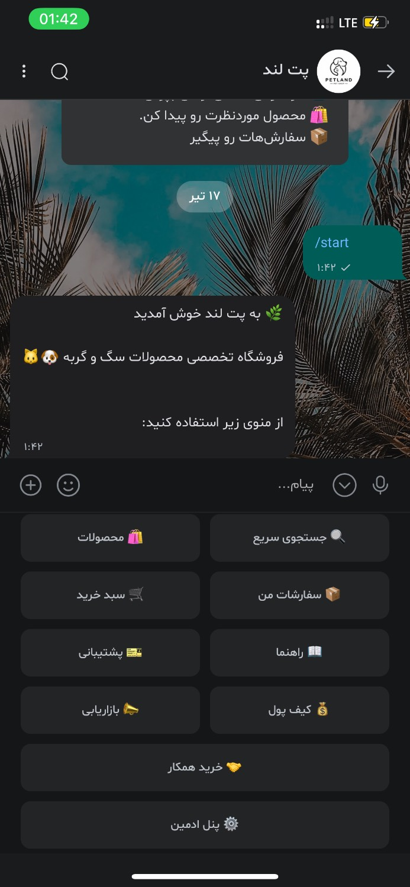
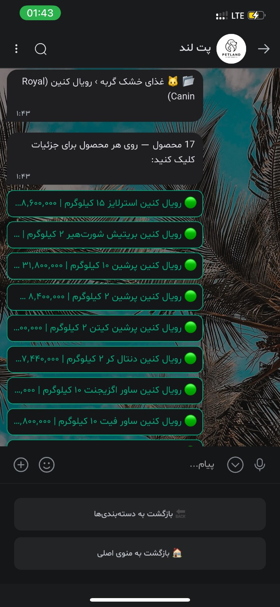
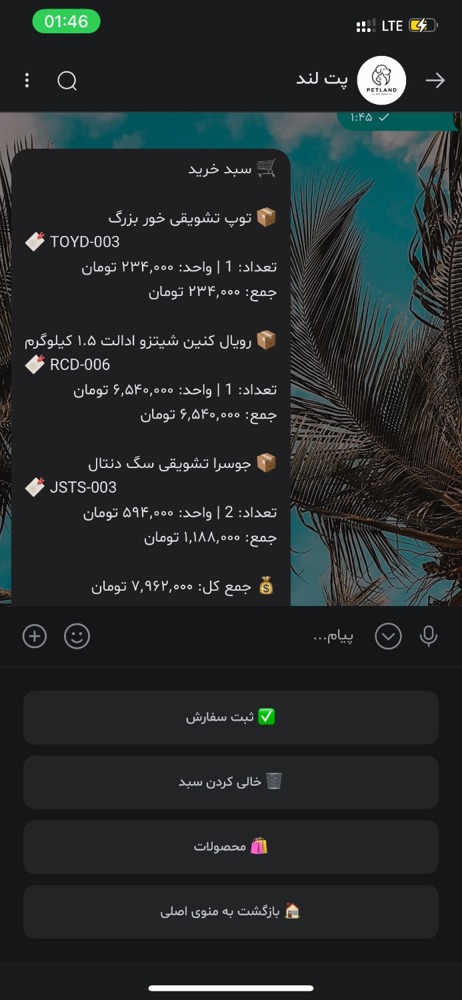

# PetLand Bot

A shopping bot for pet products on [Bale](https://bale.ai), an Iranian messenger with a Telegram-compatible API. There is no website; customers use in-chat keyboards.

The mother bot (Paw Ora) sells from a shared catalog. Wholesale partners can attach their own Bale bot and run a separate shop in the same Node.js process, with isolated products, carts, and orders.

## Features

- **Catalog and search** — 100 products in 12 categories, with photos; search by name, brand, or product code
- **Cart and checkout** — seven-step order form (name, phone, province, city, address, postal code, optional notes) and up to three saved addresses per user
- **Manual payment** — card-to-card or IBAN transfer, receipt upload, and admin review
- **Order tracking** — `PL-YYYYMMDD-####` on the mother bot; partner shops use `TS-` codes
- **Wholesale (colleague) mode** — access-code login, colleague pricing, and drop-shipping checkout
- **Partner shops** — register a BotFather token, then manage catalog, branding, bank details, and customer orders from inside the partner bot
- **Subscriptions and credit** — service packages, monthly subscription invoices (`SI-`), a credit wallet for platform fees, and a configurable golden-period bonus
- **Support tickets** — open, reply to, and close tickets in the chat
- **Referral wallet** — deep links and a 5% commission on approved referred orders (unlocked with an access code)
- **Admin panel** — order lifecycle (approve, reject, pack, ship via Snapp or post), PDF invoices, product management, broadcasts, withdrawal requests, 12-month sales figures, service invoices, shop block/unblock, and credit settings

## Screenshots

| Main Menu | Product Catalog | Order Tracking |
|-----------|-----------------|----------------|
|  |  |  |

## Tech Stack

| Layer | Technology |
|-------|------------|
| Runtime | Node.js (CommonJS) |
| HTTP | Express 5 |
| Database | PostgreSQL + Prisma 6 |
| Messaging | Bale Bot API (long polling) |
| PDF | PDFKit |

## Installation

```bash
npm install
cp .env.example .env
npm run build
npm run db:push
npm run seed
npm start
```

For local development with auto-reload:

```bash
npm run dev
```

`npm run build` generates the Prisma client. `npm run db:push` applies `prisma/schema.prisma` to PostgreSQL. `npm run seed` loads the mother catalog from `src/data/products.js`.

## Usage

After `npm start` the process listens on `PORT` (default `3000`):

| Method | Path | Purpose |
|--------|------|---------|
| `GET` | `/` | Liveness text |
| `GET` | `/health` | JSON health check |
| `POST` | `/webhook/bot/:botId` | Inbound updates for a partner bot |

The mother bot and partner bots receive messages through Bale long polling. Open the bot in Bale and send `/start`.

## Environment Variables

Copy [`.env.example`](.env.example) and fill in real values. Do not commit `.env`.

| Variable | Description |
|----------|-------------|
| `BOT_TOKEN` | Mother bot token from BotFather *(required)* |
| `DATABASE_URL` | PostgreSQL connection string *(required)* |
| `BOT_TOKEN_ENCRYPTION_KEY` | Secret used to encrypt partner bot tokens at rest |
| `PORT` | HTTP port (default: `3000`) |
| `PUBLIC_BASE_URL` | Public HTTPS origin, used to build partner webhook URLs |
| `ADMIN_BALE_IDS` | Comma-separated Bale user IDs with admin access |
| `COLLEAGUE_ACCESS_CODE` | Access code for wholesale (colleague) mode |
| `MANELI_ACCESS_CODE` | Access code for Maneli marketer wholesale panel |
| `MARKETING_ACCESS_CODE` | Access code for referral and wallet features |
| `DEFAULT_PROFIT_PERCENT` | Retail markup over cost price (default: `15`) |
| `WHOLESALE_MIN_ORDER` | Minimum wholesale order in Toman (default: `0`) |
| `SHOP_NAME` | Mother shop display name (default: `پائورا`) |
| `BANK_CARD` | Card number shown for manual payment |
| `BANK_IBAN` | IBAN for wire transfers |
| `BANK_HOLDER` | Account holder name |
| `BANK_NAME` | Bank name |
| `BOT_USERNAME` | Bot username without `@` (referral links) |

## Project Structure

```
src/
├── index.js           # HTTP server and process entry
├── seed.js            # Mother catalog seeder
├── config/            # Environment loader
├── database/          # Prisma client
├── bot/               # Bale API client and polling engine
├── handlers/          # Message and callback handlers
├── keyboards/         # Reply and inline keyboards
├── services/          # Billing, credit, partner shops, scheduled jobs
├── utils/             # Pricing, tracking codes, invoices
└── data/products.js   # Mother catalog seed data
prisma/
└── schema.prisma      # Database schema
```

## License

[MIT](LICENSE)
